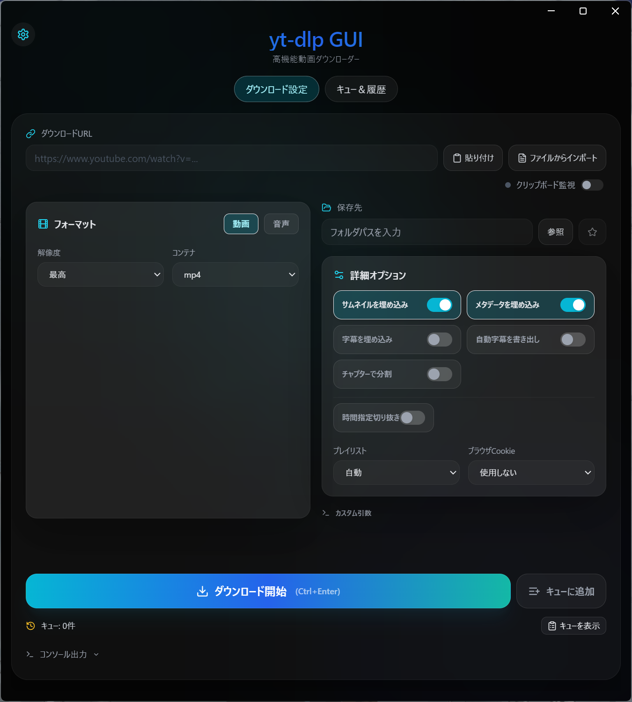
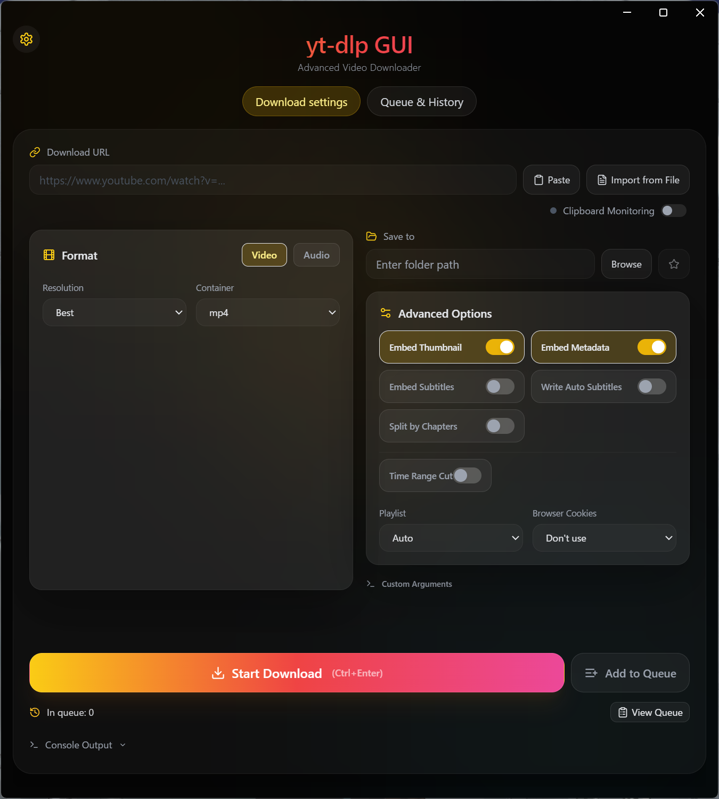

# yt-dlp GUI

<table>
  <tr>
    <td align="center">
      
       
      <em>日本語インターフェース</em>
    </td>
    <td align="center">
      
       
      <em>English Interface</em>
    </td>
  </tr>
</table>

[日本語](#日本語) | [English](#english)

---

## 日本語

モダンで使いやすい `yt-dlp` のクロスプラットフォーム GUI フロントエンドです。

### 最新リリース: v1.3.3

- プレビュー取得を高速化し、必要な場合だけ `yt-dlp` にフォールバックするようにしました。
- `timeout` / 認証要求 / レート制限などのエラーを区別して表示するようにしました。
- `ffmpeg` の配布元を見直し、macOS Apple Silicon を含む自動導入を安定化しました。

詳細は [ChangeLogs/v1.3.3.md](./ChangeLogs/v1.3.3.md) を参照してください。

## ✨ 主な機能

*   **モダンなユーザーインターフェース**: 直感的で美しいデザイン
*   **多言語対応**: 日本語・英語
*   **高速な動画情報プレビュー**: URLを入力すると、軽量取得を優先しつつ必要時のみ `yt-dlp` にフォールバックしてサムネイル・タイトル・チャンネル名などを表示
*   **プレイリスト対応**: ギャラリー風ナビゲーションで複数動画をまとめてダウンロード
*   **動画ダウンロード**: MP4, WebM, MKV / 解像度: 4K〜360p
*   **音声ダウンロード**: MP3, M4A, AAC, WAV, FLAC
*   **高度なオプション**: サムネイル埋め込み、メタデータ追加、字幕埋め込み、チャプター分割、時間範囲指定、ブラウザCookie連携
*   **便利な機能**: クリップボード監視、ダウンロード履歴、プリセット、お気に入りフォルダ、通知

## 📦 インストール

### 1. アプリのダウンロード

[Releases](https://github.com/tomakura/yt-dlp-gui/releases) ページから対応するインストーラーをダウンロード･実行

| OS | ファイル | 対象 |
|----|--------|------|
| macOS | `.dmg` | Intel / Apple Silicon 両対応 |
| Windows x64 | `.exe` | 一般的な64ビット WindowsPC |
| Windows ARM64 | `.exe` | Surface Pro X, Snapdragon搭載PCなど |

💡 Windows: インストール時の注意

インストーラー実行時に「Windows によって PC が保護されました」という警告が表示される場合があります。

1. **「詳細情報」** をクリック
2. **「実行」** ボタンをクリック

これはアプリがコード署名されていないために表示される警告です。ソースコードは公開されており、安全にご利用いただけます。

💡 macOS: 初回起動時の注意

初回起動時に「開発元を検証できない」という警告が表示される場合があります。

1. **システム設定** > **プライバシーとセキュリティ** を開く
2. 「"yt-dlp GUI"は開発元を確認できないため...」の横にある **「このまま開く」** をクリック

### 2. バイナリのダウンロード（初回のみ）

アプリを起動したら、以下の手順で必要なバイナリをダウンロードしてください：

1. 右上の **⚙️** (設定)ボタンをクリック
2. **バイナリ** タブを選択
3. `yt-dlp` と `ffmpeg` の **ダウンロード** ボタンをクリック

> ⚠️ 動画情報プレビューは一部URLでバイナリなしでも動作しますが、実際のダウンロードには `yt-dlp` と `ffmpeg/ffprobe` が必要です

### 3. バイナリの更新

yt-dlp・ffmpegは、以下の手順で更新できます。

1. 右上の **⚙️** (設定)ボタンをクリック
2. **バイナリ** タブを選択
3. それぞれの **更新** ボタンをクリック

## 🚀 使い方

1. 動画のURLを入力欄に貼り付け
2. 形式（動画/音声）と品質を選択
3. **ダウンロード** ボタンをクリック

## 📝 ライセンス

[MIT License](LICENSE)

## 🙏 クレジット

*   [yt-dlp](https://github.com/yt-dlp/yt-dlp)
*   [FFmpeg](https://ffmpeg.org/)

## ☕ サポート

---

## English

A modern and user-friendly cross-platform GUI frontend for `yt-dlp`.

### Latest Release: v1.3.3

- Faster preview fetching with `yt-dlp` used only as a fallback when needed.
- Better error reporting for timeout, authentication-required, and rate-limited cases.
- More reliable automatic `ffmpeg` installation, including macOS Apple Silicon.

See [ChangeLogs/v1.3.3.md](./ChangeLogs/v1.3.3.md) for details.

## ✨ Features

*   **Modern UI**: Intuitive and beautiful design
*   **Multi-language**: Japanese and English
*   **Fast Video Info Preview**: Uses lightweight fetchers first and falls back to `yt-dlp` only when needed to show thumbnails, title, channel, and related metadata
*   **Playlist Support**: Gallery navigation for downloading multiple videos
*   **Video Download**: MP4, WebM, MKV / Resolution: 4K to 360p
*   **Audio Download**: MP3, M4A, AAC, WAV, FLAC
*   **Advanced Options**: Embed thumbnails, metadata, subtitles, chapter splitting, time-range downloads, browser cookies
*   **Convenience**: Clipboard monitoring, download history, presets, favorite folders, notifications

## 📦 Installation

### 1. Download the App

Download and run the installer for your platform from [Releases](https://github.com/tomakura/yt-dlp-gui/releases)

| OS | File | Target |
|----|------|--------|
| macOS | `.dmg` | Intel / Apple Silicon |
| Windows x64 | `.exe` | Standard 64-bit Windows PCs |
| Windows ARM64 | `.exe` | Surface Pro X, Snapdragon PCs, etc. |

💡 Windows: Installation Note

You may see a "Windows protected your PC" warning when running the installer.

1. Click **"More info"**
2. Click **"Run anyway"**

This warning appears because the app is not code-signed. The source code is open and safe to use.

💡 macOS: First Launch Note

You may see an "unidentified developer" warning on first launch.

1. Open **System Settings** > **Privacy & Security**
2. Click **"Open Anyway"** next to the message about "yt-dlp GUI"

### 2. Download Binaries (First Time Only)

After launching the app, download the required binaries:

1. Click the **⚙️** (Settings) button in the top right
2. Select the **Binary** tab
3. Click the **Download** button for `yt-dlp` and `ffmpeg`

> ⚠️ Video info preview may work for some URLs without local binaries, but actual downloads require `yt-dlp` and `ffmpeg/ffprobe`

### 3. Update Binaries

You can update yt-dlp and ffmpeg as follows:

1. Click the **⚙️** (Settings) button in the top right
2. Select the **Binary** tab
3. Click the **Update** button for each

## 🚀 Usage

1. Paste a video URL into the input field
2. Select format (video/audio) and quality
3. Click the **Download** button

## 📝 License

[MIT License](LICENSE)

## 🙏 Credits

*   [yt-dlp](https://github.com/yt-dlp/yt-dlp)
*   [FFmpeg](https://ffmpeg.org/)

## ☕ Support

